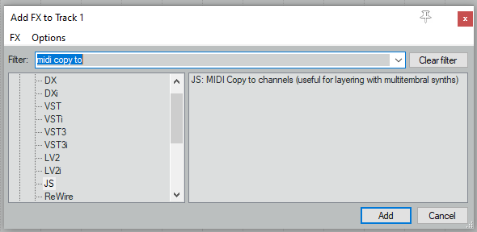
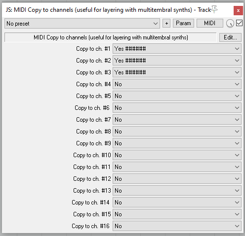

# MIDI Copy to channels

## Overview

A Jesusonic plugin intended to duplicate MIDI voice messages to any number of channels.

I wrote this little plugin to make it easier to create multilayered sounds with multitempbral VSTi (such as TTS-1). You play one note, and it results in several identical notes sent to different MIDI channels. With proper configuration, you can make your VSTi output a fatter, richer and more interesting sound.

## Installation

Take [this file](https://raw.githubusercontent.com/hq9000/reaper_tools/master/js/midi_copy_to_channels.js) and somehow put it to a directory where your Reaper expects to find all JS plugins. Restart Reaper, then insert this plugin as you would insert any other plugin:

On my Windows, the path to where JS plugins are stored is as follows: `c:\Users\XXX\AppData\Roaming\REAPER\Effects\midi` (yours is likely to be different).

## Usage

The settings shown on the screenshot below make the plugin consume notes from any midi channel and sends the exact copies of them to channels 1, 2 and 3, 
resulting in 3 different patches playing the same melody. The original notes are muted.

## Bugs and suggestions

Feel free to create issues in this GitHub repository.

